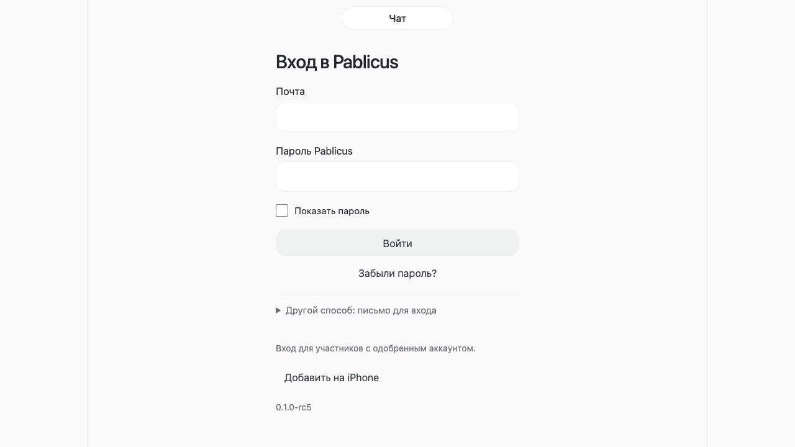

# Pablicus — D0 / Design Foundation Audit

Версия: R1 · 12 сентября 2026 · для Матвея.
Задание: PABLICUS-CHIEF-DESIGNER-BOOTSTRAP-20260912 R1.
Статус: **D0_SOURCE_AUDIT_DELIVERED_WITH_VISUAL_EVIDENCE_GAP**. Это инвентаризация канонических документов и исходников, не завершённый визуальный аудит работающего продукта. Дизайн не утверждён; D1–D7 не выполнены.

Главный вывод: архитектурная основа единого продукта уже определена, но нынешние интерфейсы покрывают только часть утверждённой модели. Проектировать нужно переход между одними и теми же сущностями и правами во всех поверхностях. Наличие формы, карточки или записи в registry нельзя принимать за готовую возможность.

## 1. Что прочитано и как восстановлен контекст

Репозиторий: `matveyryabokon30-crypto/vision-talk`, ветка `refactor/pablicus-foundation-20260911`. Изолированный снимок после свежего fetch: **d791adc19aade1015f4ba34cf4beb5ce2069c93f**. Снимок лежит в [design-d0-source](../design-d0-source/). Рабочие копии других контуров не изменялись. AGENTS.md в исследованном снимке не найден.

Прочитаны все девять обязательных документов:

| ID | Документ | Что определяет |
|---|---|---|
| P1 | [Continuation Plan](../design-d0-source/docs/pablicus/approved/2026-09-11/Pablicus_Continuation_Plan_2026-09-11.md) | Единый продукт, пять блоков, настоящий сервис и контентный/видеорезультат |
| A1 | [Amendment 01](../design-d0-source/docs/pablicus/approved/2026-09-11/AMENDMENT_01_UNIVERSAL_AI_ASSISTANT.md) | Универсальный помощник, история, память, файлы, источники, границы полномочий |
| A2 | [Amendment 02](../design-d0-source/docs/pablicus/approved/2026-09-11/AMENDMENT_02_COMPETITIVE_CAPABILITIES.md) | CATEGORY_A/B/C, конкурентный функциональный слой |
| O1 | [Owner Decision](../design-d0-source/docs/pablicus/approved/2026-09-11/OWNER_DECISION.md) | План утверждён; исторический заголовок «предложение» не отменяет решения |
| O2 | [Owner Decision 01](../design-d0-source/docs/pablicus/approved/2026-09-11/OWNER_DECISION_AMENDMENT_01.md) | Помощник входит в первый релиз дополнительно к исходному составу |
| O3 | [Owner Decision 02](../design-d0-source/docs/pablicus/approved/2026-09-11/OWNER_DECISION_AMENDMENT_02.md) | Три основные вкладки и релизная обязательность A |
| A3 | [Amendment 03](../design-d0-source/docs/pablicus/approved/2026-09-12/AMENDMENT_03_DESIGN_AUTHORITY_AND_ORIGINAL_ASSETS.md) | Полный дизайн-контур D0–D7 и оригинальные assets |
| O4 | [Owner Decision 03](../design-d0-source/docs/pablicus/approved/2026-09-12/OWNER_DECISION_AMENDMENT_03.md) | Матвей утверждает ключевые решения; engineering handoff после approval |
| R1 | [Design Reference Register](../design-d0-source/docs/pablicus/design/2026-09-12/DESIGN_REFERENCE_REGISTER.md) | Исследовательские ссылки, запрет копирования, гипотеза раскрытия объекта |

Дополнительно прочитаны актуальная часть [PABLICUS_CONTEXT.md](../design-d0-source/PABLICUS_CONTEXT.md), Source Scope, архитектура и component registry 2A, независимое решение 2A, implementation report 2B; структурно исследованы manifests, ownership/component maps и test-results 2A/2B. Исторические CI PASS ниже пересказываются как документальные сведения: новые инженерные тесты не запускались.

Исследованы entrypoint `pablicus/index.html`, токены и подключённые стили; участки app.js с home/profile/search/outbox/auth; shell/registry contracts; модули Chat Library, Canvas, Tasks, Composer, Workspace Editor, Quick Access, People, Message Menu, Bots, Factory, Scenario Editor, notifications; provenance брендовых assets. Это целевое чтение, не построчный аудит всех runtime-модулей. Точная ведомость источников и SHA-256 — [SOURCE_LEDGER.csv](SOURCE_LEDGER.csv).

**Уточнение статуса относительно задания.** Независимо принят 2A на `9ee215300ac97b3c48bf5184f414f28333429a1c`. Свежий HEAD уже содержит отдельно выполненный Исполнителем 2B: `SUBSTEP_2B_READY_FOR_INDEPENDENT_REVIEW`, code/tested SHA `c5e26c2f85ef1f6d1f8ab4684d033de4f3b0d3c9`. Решения ACCEPTED для 2B в исследованном наборе нет. Поэтому последний подтверждённый acceptance — `SUBSTEP_2A_ACCEPTED`; Block 2 целиком не принят. D0 не начинает и не принимает 2B. Текущий UI ниже относится к свежему HEAD, а не выдаётся за точный принятый 2A.

**Граница наблюдения.** Первая попытка открыть локальный исходник в in-app Browser завершилась тайм-аутом; повторная удалась. Получен, сохранён и осмотрен screenshot экрана входа 1280×720. Внутренние экраны требуют авторизации; тестовая сессия не предоставлена. Авторизованный поток, Safari, физический iPhone, keyboard/Dynamic Type, контраст отрисованного glass внутренних экранов и screen reader не проверены. Исторические скриншоты другого контура не выданы за новые наблюдения. Полный визуальный аудит остаётся открытым пунктом D0-V1; документальная часть и scope inventory переданы сейчас.

## 2. Восстановленный product context

Pablicus — среда общения, совместной работы, AI и выпуска сервисов. Основная цепочка: разговор → рабочий объект → действие → AI/агент → проверяемый результат → повторно используемый сервис. Свободный AI-разговор возможен без проекта и без создания бота.

| Сущность | Смысл и дизайн-инвариант |
|---|---|
| Space / Community | Контейнер разговоров, людей, ролей, объектов и сервисов; текущая область видна пользователю |
| Conversation | История общения; собственный ID и права |
| Thread | Ветка обсуждения; не редактор и не Полотно |
| Topic | Тематическая организация; необходимо согласовать точную связь с Thread |
| Message | Авторское сообщение с безопасными блоками; ссылка на объект не создаёт новую копию объекта |
| Canvas / Полотно | Долговечная рабочая поверхность, содержащая объекты |
| Work Object | Самостоятельный объект, ID, ревизия, источник, авторство, разрешённые действия |
| Agent Run | Долговечное исполнение: инициатор, исполнитель, контекст, бюджет, статус, отмена, результат |
| Approval | Согласие на конкретное действие/параметры/ревизию со сроком, а не общий доступ |
| Result | Проверяемый объект/файл/действие; обычный ответ AI также допустим, без ложного заявления об исполнении |
| Service | Версионируемый работающий экземпляр, созданный или установленный с ограниченными правами |
| Publication | Безопасное опубликованное представление; приватный оригинал не открывается по живой ссылке |

Три вкладки: **Чаты / Дела / Вы**. По принятой IA 2A Чаты дают вход в разговоры и будущие Spaces, поиск, Saved, личный AI; Дела — задачи и вложенные Bots/Factory; Вы — профиль, настройки, public identity и личные shortcuts. Это базовая структура, окончательное размещение новых входов ещё требует дизайна. Четвёртой вкладки нет.

AI CHAT, AI IN CONTEXT и AI INLINE разделяются видимым объёмом доступного контекста. AI in Composer — место применения inline/contextual AI, не четвёртая серверная система. История, текущий контекст модели и сохраняемая память различимы. Упоминание агента не даёт ему доступ ко всему Space или аккаунту.

Первый релиз включает P1 + A1 + CATEGORY_A из A2: реальные разговоры, Полотно, объекты, помощник, агент в разговоре, работающая Factory, каналы/подписки, контентный редактор и ограниченный реальный видеоконвейер. B — архитектурная готовность, C — последующее отдельное решение. Calls/live, сложные рекомендации, коммерция и развитые автономные цепочки нельзя незаметно перевести в обязательную полную реализацию первого релиза. Stories упомянуты в нынешней заглушке, но их релизный объём этим не утверждён.

## 3. Design Scope Matrix

Полная строковая карта функций, необходимых экранов, состояний, компонентов, evidence и блоков: **[DESIGN_SCOPE_MATRIX.md](DESIGN_SCOPE_MATRIX.md)** и [CSV](DESIGN_SCOPE_MATRIX.csv). ID строки — стабильный ID семейства потока; перечисленные поверхности внутри строки не обязательно отдельные URL.

Статусы текущего UI: `SOURCE_BASELINE` — найдена реализация в коде, без нового live-подтверждения; `PARTIAL` — найден только более узкий сценарий; `CONTRACT_ONLY` — декларация; `NOT_ESTABLISHED` — соответствующая реализация не установлена исследованием; `UNLOADED_LEGACY` — файл есть, но не часть подтверждённого entry graph. Ни один из этих статусов не равен дизайн- или инженерной приёмке.

Все строки проходят D5. Основные потоки относятся к D3, расширенные — к D4, система компонентов — к D2. Все имеют owner decision `PENDING`, font/icon state `INTERIM_TO_QUALIFY / ORIGINAL_NOT_CREATED`. Матрица сохраняет отдельные обязательства для контента/видео, памяти AI, делегирования и обновления PWA — их нельзя потерять среди новых красивых экранов.

## 4. Inventory текущего UI

| Поверхность / источник | Что есть по исходнику | Граница |
|---|---|---|
| index.html, app-shell.js, shell.css | Auth/home/conversation, три вкладки, общая шапка, safe-area/viewport contracts | Registry и геометрия не равны полной дизайн-системе |
| app.js: renderHome | Чаты, поиск по названию, «Все/Фокус», unread, поиск людей, Избранное | Нет доказательства единого поиска по всем типам |
| chat.js + app.js | История, отправка, очередь, возврат к сообщениям, draft integration | Старый стендовый DOM содержит скрываемые технические подписи; видимость в живом UI не проверена |
| message-menu.js, chat-actions.js | Контекстные действия, replies/reactions, привязка дела к сообщению | Это не универсальные rich actions и agent approvals |
| rich-composer.js | Упорядоченные текстовые/media blocks, файлы, голосовая запись, inline/fullscreen | AI/commands/agent invocation объявлены как расширения |
| chat-library.js | Поиск в открытом разговоре; Медиа/Файлы/Голосовые/Ссылки; переход к источнику | Не global search |
| media-viewer.js | Фото/видео viewer, закрытие и возврат фокуса в текущем 2B | Новый Close — код кандидата 2B, не новая независимая приёмка |
| chat-canvas.js | Проект, rich editor, дела, исполнитель, даты, reminders, архив, conflict recovery | Work Object v2 и общий revision browser не установлены |
| tasks-home.js | Все/Мне/Просрочено/Готово/Архив, поиск, пагинация, переход к делу в чате | Есть видимые состояния конфликта и неоднозначного сохранения |
| workspace-quick.js | «Сегодня/Проекты» из разных разговоров | Нужна проверка нагрузки на composer и ясности области |
| app.js: profile; people.js | Имя/@username, профильная ссылка, тема, storage, push, passkeys, выход | Public identity базовая; social profile и privacy centre ещё шире |
| bots.js | Список/создание/настройки бота, переписка, заявки, статус | Bot Core baseline не заменяет универсального агента |
| bot-scenario-editor.js, bridge | Шаги Message/Question/Choice/Save/End, переходы, сохранение версии | Внутренний конструктор; не готовая Factory полного цикла |
| bot-factory.js | Brief, материалы, уточнения, проект, capabilities, план сборки | Формирование плана; работающий сервис/видеорезультат не доказаны |
| push-notifications.js, inbox-monitor | Подключение уведомлений, состояния устройства, overlay входящих | Не полный центр уведомлений и не Personal Inbox |
| access.html / passkey-start.html | Отдельные account/access surfaces | Нужна общая визуальная система и мобильная проверка |
| creation-flows.js | Локальные формы создания групп/каналов/контактов через localStorage | Не подключён index.html; нет основания считать действующими серверными сообществами |
| component-registry.js | SidePanel, FullScreenObjectView, WorkObjectPreview, AgentTaskCard, PrivateAgentResult, ActionConfirmation | `INTERFACE_ONLY` для будущих поверхностей |

Важные существующие числа — **baseline, не выбранный будущий дизайн**: system font stack, body 17px/input 16.5px, иконка 22px, control 44px, spacing 4/8/12/16/24, radius 16/pill, 160ms ease-out, breakpoints 768/1024; встречаются локальные 800px. Glass light .82/dark .88, другие bubbles используют собственные opacity. Blur встречается 3/5/8/20/22/24px. Глобальный z-index scale сосуществует с локальными 1800/6000. Выбор окончательных значений — D2.

### Свежее визуальное наблюдение V01 — вход
+
+
+
+Шаг 1: локальный entrypoint → экран входа. Состояние: форма отрисована, поля и основной путь видны; доступ к внутренним потокам не получен. На снимке видны подписи полей, кнопки входа/восстановления, альтернативный способ, сообщение об одобренных аккаунтах и установка на iPhone. Скриншот подтверждает только этот экран, не работу Auth.
+
+Наблюдение V01-1: над формой входа находится подпись «Чат», хотя пользователь ещё не в разговоре. Это создаёт неоднозначный контекст оболочки; в D2/D4 требуется явная auth-иерархия. V01-2: видимый release label `0.1.0-rc5` не сообщает исследованный Git SHA; в пакете аудита версию нужно определять по manifest, а не по этой подписи. Светлые границы полей требуют отдельного contrast/focus исследования; по одному screenshot соответствие доступности не заявляется.
+
+Шаг 2: авторизованный Чаты → объект → панель → возврат. Состояние: **не обследован визуально — отсутствует тестовая авторизованная сессия**. Автоматическое создание аккаунта, восстановление пароля или запрос доступа не выполнялись.
+
+## 5. Необходимые экраны и пути между ними

Подробный список находится в колонке «Необходимые поверхности» scope matrix. На уровне продукта нужны следующие сквозные цепочки:

1. Вход/восстановление → Чаты → выбор человека/группы/Space → разговор → Thread/Topic → найденное исходное сообщение.
2. Сообщение → создание/связывание дела или объекта → компактная карточка → панель → fullscreen → точный возврат в чат.
3. Composer с черновиком/вложениями → inline AI → сравнение оригинала и предложения → принять/отклонить → отправить человеком.
4. Личный AI-разговор → выбор файлов/источников → ответ → сохранить результат/объект → продолжить с другого устройства.
5. Контекстный агент → обзор контекста и прав → запуск → progress/approval → результат/ошибка → ревизия и проверка.
6. Дела → фильтр/поиск → детали → срок/исполнитель → источник в чате → возвращение к тем же фильтрам и позиции.
7. Вы → публичный профиль отдельно от приватных данных → Saved/настройки/память AI/уведомления/доступ/восстановление.
8. Space → участники/роли → каналы и темы → публикация/расписание → подписная лента → жалоба/модерация.
9. Factory brief → уточнения → проверяемая спецификация → сборка/проверки → приватный работающий сервис → первый контрольный результат → повторное использование.
10. Возможности → тип/издатель/версия/trust → права и область установки → запуск mini app → результат в исходном контексте → обновление/отзыв.
11. Материал/видео → оригинал/транскрипт/монтажный план → preview → правки → render → проверенный MP4 + редактируемый пост → подтверждённая публикация.
12. Deep link/уведомление → проверка сессии и прав → требуемый объект → недоступен/удалён/доступ восстановлен; возврат не зависит от того, существовал ли предыдущий чат в текущей сессии.

Calls/live проектируются позднее только как architectural surfaces: отдельная сессия, участники/роль, media permissions, вход/возврат к разговору и recording reference. Наличие slot не должно показывать пользователю обещание действующего звонка.

## 6. Необходимые компоненты

| ID | Семейство | Полный требуемый состав |
|---|---|---|
| C01 | Shell/navigation | AppShell, TopBar, BottomNavigation, SpaceSwitcher, breadcrumb/context header, responsive split layout, Back/Close |
| C02 | Controls | Button/IconButton, Input/Textarea, Select/Combobox, Checkbox, Radio, Switch, Tabs/SegmentedControl, Tooltip, focus indicator |
| C03 | Collections | List/ListItem, Avatar/AvatarGroup, Badge, Chip, counters, filter bar, pagination/load more, virtual-list anchor |
| C04 | Overlays | Modal, Sheet, Menu/ContextMenu, Popover, Toast, SidePanel, FullScreenObjectView, leave guard |
| C05 | Communication | ConversationRow/Header, MessageBubble, author/meta/delivery, ReplyPreview, ReactionPicker/Bar, ThreadPreview, TopicRow, unread separator, jump-to-message |
| C06 | Composer | Text surface, rich toolbar, attachment tray/upload row, file picker, voice recorder, reply strip, command/mention picker, AI action menu, draft save indicator, expand/collapse |
| C07 | Rich blocks | Text/heading/list/table/quote/code, image/video/audio/file, link/source, form, poll, event, checklist, reminder, carousel, task/action/result/service preview |
| C08 | Objects | ObjectCard/Header, identity/source breadcrumb, revision label/history/diff, editor/viewer, comments, collaborators, conflict resolution, publish snapshot preview |
| C09 | Tasks | TaskRow/Card/Detail, assignee picker, due-date/calendar/time/timezone, reminder selector, progress, archive actions, source link |
| C10 | AI | AIConversationRow, context selector/receipt, inline proposal/diff, sources, streaming response, stop/retry, memory item/editor, quota/usage explanation |
| C11 | Execution | AgentCard, permission summary, RunCard/Timeline, delegation entry, progress/checkpoint, cancel, ActionConfirmation, ResultCard, failure recovery, budget limit |
| C12 | Social | Space/Channel card/header, member/role row, invitation/join request, publication editor/preview, schedule, follow, discovery result, report/block, moderation log |
| C13 | Services | CapabilityCard, type label, publisher/version/trust badge, install/permission sheet, connection status, Factory brief/spec/build/test, service instance, mini-app host bar, revoke/update |
| C14 | Account | Profile/public identity, privacy control, device/session row, passkey state, notification setting, local storage/update status, recovery form |
| C15 | Feedback | EmptyState, Skeleton/Loading, InlineError, Warning/Success, Offline/Reconnect banner, stale/expired/permission state, destructive confirmation, Undo |
| C16 | Media work | Transcript/timecode row, timeline/clip, subtitle style controls, render progress, playback verification, output/download, publication approval |
| C17 | Future sessions | Call/session header, mic/camera/share state, participant/speaker/audience, connection recovery, permission prompt, return-to-session, recording reference |

Примитивы C01–C04/C15 обслуживают все области. Один и тот же объект использует C08 в чате, Дела, Saved, AI-result и mini-app host. Registry 2A с 29 декларациями — отправная карта ownership; это не перечень всех будущих дизайнерских компонентов.

## 7. Карта состояний

| ID | Набор | Состояния и обязательное различение |
|---|---|---|
| S01 | Control | default, hover, focus-visible, pressed, selected, disabled с причиной, busy, read-only; selected и focused различимы |
| S02 | Data | initial, empty, loading, partial, ready, refreshing со старым содержимым, pagination, no results, error/retry |
| S03 | Network/storage | offline, queued, saving locally, saved locally, sending, server confirmed, delivered/read только при факте, unknown outcome, reconnect, retry, storage full/unavailable |
| S04 | Editor | clean/dirty, selection, composing/IME, attachment pending/failed, recording/interrupted, saving, saved, conflict, deleted source, unsaved-leave |
| S05 | Identity/access | signed out, booting, pending approval, authenticated, expired session, account switch, denied, revoked, removed member, blocked/deleted account |
| S06 | AI/run | ready, selecting context, queued, generating/running, waiting tool, awaiting approval, delegated, paused где поддержано, cancelling, cancelled, interrupted, partial result, failed, quota/budget reached, completed with evidence |
| S07 | Object/collaboration | compact, expanded, fullscreen, view/edit, outdated revision, collaborator editing, agent proposal, comments, compare, conflict, unavailable/deleted object |
| S08 | Publish/service | private draft, review, scheduled, publishing, published, rejected, unlisted/revoked, install pending, connected, permission changed, update incompatible, expired approval |
| S09 | Responsive/accessibility | narrow phone, normal phone, landscape, tablet, desktop/resize, keyboard open/closed, all safe areas, long RU/EN, long URL/name, large text, reduced motion/transparency, high contrast, keyboard/screen reader |
| S10 | Future media | invited, permission requested/denied, joining, active, muted, camera off, sharing, reconnecting, ended; future only |

Каждая строка scope matrix наследует S01/S02/S05/S09; остальные перечислены индивидуально. Это coverage obligations, не утверждение, что все сочетания существуют сейчас. Перед D5 строится набор применимых комбинаций с мотивированными N/A. Критические комбинации: dirty + offline + close; approval + expired revision; account switch + late result; fullscreen + keyboard + large text; removed source + Saved/deep link; повтор после неизвестного результата без второго побочного эффекта.

Принцип feedback: сообщение об ошибке отвечает «что произошло, что сохранилось, что можно сделать». Нельзя писать «черновик сохранён» без подтверждения сохранения. «Сохранено на устройстве», «принято сервером», «прочитано» и «опубликовано» — разные состояния.

## 8. Icon inventory и требования к оригинальной системе

Полный семантический список D0: [ICON_INVENTORY.csv](ICON_INVENTORY.csv). Текущие определения, автоматически извлечённые из выбранных модулей: [CURRENT_ICON_DEFINITIONS.csv](CURRENT_ICON_DEFINITIONS.csv). Целевые ID не являются готовыми assets. Повторения значения между группами должны разрешаться reuse в D2, а не механическим рисованием дублей.

Найдены: приложение с утверждённой glass speech-bubble icon (`assets/PROVENANCE.json`, выбор 09.09), raster wordmarks, SVG provider в message-menu.js, собственные локальные maps Canvas/Tasks/Quick Access, текстовые символы в index.html. **message-menu.js прямо указывает адаптации Lucide (ISC) и Feather (MIT) и содержит notices.** Это interim source, не собственная Pablicus Icon System. Полный provenance всех прочих локальных paths не установлен; отсутствие notice само по себе не доказывает нарушение. Коммерческий pack в прочитанном entrypoint не установлен как зависимость.

В D2 требуются master grid и optical sizes; геометрическая грамматика, stroke/corner rules и corrections; outline/active/filled по семантике; размеры рисунка отдельно от touch target; unread/status/badge placement, максимальные overlays; static fallback для motion; правила подписи и accessible name. Общий ориентир проверки — интерактивная область минимум 44×44 CSS px, но точные размеры и исключения ещё не утверждены. Значение не должно передаваться только цветом или маленьким badge.

Web handoff: редактируемые векторные masters, versioned SVG exports с viewBox/currentColor, без scripts/external assets, semantic-name manifest, light/dark/forced-color проверка и licence/provenance ledger. Будущий native: согласованные point sizes и векторный экспорт для платформенных asset catalogs; отдельный app-icon raster pipeline. Glyph font для UI-иконок не предполагается по умолчанию. Morph допустим лишь между состояниями одной функции, с понятным статичным эквивалентом. Экспортный формат и численная геометрия выбираются после owner direction, а не в D0.

Утверждённый app icon и будущий набор функциональных иконок — разные активы. D0 не перерисовывает app icon и не отменяет его прежнее утверждение. Для wordmark требуется происхождение оригинала и шрифтовая основа; hash подтверждает байты, но не заменяет права.

## 9. Typography requirements

Interim baseline уже использует системный стек `-apple-system, BlinkMacSystemFont, Segoe UI, sans-serif`. На D0 его можно сохранить как существующую основу без включения сторонних font-файлов. Это обращение к установленным системным гарнитурам, не разрешение копировать и распространять их файлы. Новый downloadable interim font в D0 не выбран; его licence/version и реальные RU/EN specimens проверяются на D1/D2 до использования.

| Область | Требование к D1/D2 и будущему font-production brief |
|---|---|
| Proportions | Сопоставить нейтральные/гуманистические пропорции на одинаковом UI; не копировать гарнитуру референса |
| x-height | Достаточная читаемость labels и текста; измерить на small sizes, не выбирать по красивому заголовку |
| Latin/Cyrillic | Полная русская кириллица с Ё/ё, латиница и нужная пунктуация; открытые формы, различимые I/l/1, O/0, З/3, й/и; настоящая кириллица без подстановки латинских похожих знаков |
| Weights/width | Text Regular/Medium/Semibold; display weight при необходимости; не полагаться на synthetic bold; не сжимать длинный русский текст искусственным scale |
| Text | Несколько абзацев RU/EN, ссылки, quotes, mentions, monospace code fallback; устойчивые line-height и fallback metrics |
| Compact labels | Длинные кнопки/названия ролей/файлов без потери основного действия; двухстрочный label там, где truncation скрывает смысл |
| Large titles | Заголовки объектов/Space, допустимые переносы и ясная иерархия без оттеснения Close/Back |
| Numbers | Proportional для текста; tabular для бюджетов/статистики/таймеров; даты, часовые пояса, знаки валют и минус, неразрывные пробелы, decimal separators |
| Accessibility | Масштабирование и пользовательский размер текста без фиксированной высоты строк; контраст и чтение длинных форм |
| Variable axes | Исследовать wght и opsz; wdth/GRAD только при доказанной UI-пользе и бюджете. Набор осей не утверждён |
| Production | Coverage, masters, hinting, kerning, metrics, file budget, WOFF2/web и future native formats, ownership/licence, versioning, fallback and font-loading tests |

Target — собственная типографическая идентичность Pablicus. Она начинается с пропорций, ритма, цифр, русской типографики и использования, а не с заявления, что системный шрифт уже стал собственным font asset.

## 10. Motion / interaction inventory

| ID | Переход | Что объясняет / что сохранять |
|---|---|---|
| M01 | Root navigation / Space switch | Контекст и выбранный раздел; позиция/фильтры каждого списка |
| M02 | List → conversation → back | Открытую беседу, unread/scroll anchor, draft и originating list position |
| M03 | Message → object card → panel | Одна identity/revision; происхождение объекта, независимый foreground |
| M04 | Panel → fullscreen → panel/chat | Изменение рабочего пространства без нового объекта/потери selection |
| M05 | Composer expand / keyboard | Рост области ввода; тот же editor/draft/files/IME и видимый Send/Close |
| M06 | Menu / sheet / modal | Иерархию действий, modal semantics, initial focus, Escape/Back, return focus |
| M07 | New message / jump / located result | Новое событие без скачка старой истории; источник найденного сообщения |
| M08 | Inline AI proposal → accept/reject | Авторство, diff и точную ревизию; отмена не уничтожает исходный текст |
| M09 | Agent queued → progress → approval → result | Фактическую фазу; длительный run не имитируется декоративным таймером |
| M10 | Conflict / remote edit / agent edit | Какое содержимое изменилось; не заменять выбранную строку молча |
| M11 | Media open / playback / close | Источник и управление; доступный Close наряду с gesture |
| M12 | Task complete / archive / undo | Результат действия без потери соседнего фокуса и положения списка |
| M13 | Offline → reconnect / retry | Что локально, что подтверждено; отсутствие повторного действия |
| M14 | Publish / install / mini-app launch | Переход области прав и приватности; app host и publisher всегда различимы |
| M15 | Calls/live session overlay | Независимую сессию и путь обратно; только будущая готовность |

### Центральный interaction contract — требования D0, не финальное решение D3

До раскрытия сохраняются user/account ID, Space/Conversation/Thread/Topic ID, исходный message ID, object ID/revision, selected object, draft/text/files/order/selection, anchor сообщения + относительное смещение, позиция панели и opener/focus. Пиксельный scrollTop сам по себе недостаточен при догрузке медиа или новых сообщениях.

При раскрытии пользователь видит заголовок/тип объекта, источник и доступные действия. Тяжёлая загрузка допускает skeleton в панели, но не очищает чат. Панель прокручивается самостоятельно; drag не смещает underlying chat. Выбор элемента в независимой панели не меняет выбранный объект под ней без явного перехода. При ротации/resize сохраняются ID, draft и edit selection.

На D1 сравниваются доступные модели; на D3 для каждой ширины фиксируется **modal или non-modal**. В modal-состоянии фон inert, фокус ограничен поверхностью, есть видимый Close/Back. В non-modal desktop panel сохраняется доступность чата, объявлены обе области и переключение фокуса. Нельзя сочетать видимость интерактивного фона с недокументированным блокированием кликов. Полноэкранность сама по себе не определяет modal semantics.

Закрытие через кнопку, Escape, browser Back и gesture проходит одну понятную политику. Dirty/pending/recording states нельзя терять. Сначала разрешается уход, потом проигрывается закрытие; клавиатура не должна случайно закрывать объект. Для long content шапка и action area остаются достижимы, прокручивается содержимое; длинная шапка не перекрывает форму.

Возврат восстанавливает тот же разговор/объект/черновик/anchor. Если источник удалён, показывается объяснение и ближайший доступный контекст, без ложного «точного возврата». Если объект изменился — видна новая ревизия и сохранён собственный edit buffer. При отзыве прав или смене аккаунта приватный буфер не показывается другой identity. Deep link без исходного чата получает самостоятельный путь Back.

Safe areas учитываются со всех четырёх сторон, status area/Dynamic Island не используются под управляющие элементы. Keyboard-open geometry опирается на видимую область; нет двойного нижнего отступа. One-hand сценарии сохраняют нижние часто используемые действия, но Close остаётся явно доступным. Для reduced motion пространственное объяснение сохраняется без обязательного zoom/morph; для reduced transparency/high contrast — непрозрачный фон. Числа duration/easing/blur и haptics утверждаются позднее. Future haptics: смысловые события selection/confirmation/error, всегда с визуальным/доступным эквивалентом.

## 11. UX / design conflicts

Это source-backed conflicts и вопросы дизайна, не список заново доказанных runtime-дефектов.

| ID / приоритет | Evidence | Конфликт / следующий результат |
|---|---|---|
| X01 / высокий | PABLICUS_CONTEXT + 2B manifest | Задание отражает момент до 2B, HEAD — candidate 2B. Каждый дизайн-review должен называть SHA и acceptance отдельно |
| X02 / высокий | registry + A2 | Future components выглядят полным реестром, но остаются декларациями. В спеках явно маркировать current/target |
| X03 / высокий | Canvas, WorkspaceEditor + A2 | «Проект»/редактор/Полотно не образуют ещё полный Work Object contract. Нужны единые identity/revision/source representations |
| X04 / высокий | Factory renderProject/renderPlan + P1 | «Готов к планированию/План готов» может быть спутано с готовым сервисом. Развести проект, сборку, проверку, запуск и подтверждённый результат |
| X05 / высокий | app.js search + chat-library + A2 | Три разных входа: title filter, People search, chat materials. Нужны global scope, permissions и ясное переключение private/public |
| X06 / высокий | app.js saved + inbox-monitor + A2 | Избранное, Personal Inbox и overlay новых сообщений не одна сущность. Нужны единые save semantics и distinct notification semantics |
| X07 / высокий | A1/A2 + composer contract | AI entry points без согласованного context receipt. Ошибка восприятия может превратить помощь в неявное действие; нужен preview контекста/прав |
| X08 / высокий | style/token/local CSS | Glass использует разные opacity/blur/fallback. Нельзя заключить о контрасте по цветовой паре токенов; нужны rendered checks на светлых/тёмных/пёстрых фонах |
| X09 / средний | MessageMenu/Canvas/Tasks/index | Lucide-derived SVG, локальные 1.6px paths и символы имеют разные grammar. Нужен оригинальный master inventory без присвоения сторонних assets |
| X10 / высокий | provenance | App icon утверждён; provenance wordmark не раскрывает font licence/creation source полностью. Не менять icon автоматически и не объявлять полный asset audit пройденным |
| X11 / средний | 2B report/map | Dirty-sheet browser confirm и native popover fullscreen уже изменены кандидатом. Не сообщать старые defects как действующие; оценить системный UX guards и browser fallback |
| X12 / высокий | 2B limits + local CSS | Критические 44px targets проверялись ограниченно, calendar compact exceptions сохранены. Нужна полная touch/large-text карта, включая long RU |
| X13 / средний | tokens/shell/component styles | Breakpoints 768/1024 сосуществуют с 800, z-index scale — с local literals. Для D2 нужны единые правила responsive/overlays, не глобальный hotfix |
| X14 / средний | index + app.js: unavailable/renderHome | В исходнике есть demo/debug и «следующее обновление». Видимость не проверена; релизный copy должен говорить о доступности, не обещать неутверждённые сроки |
| X15 / высокий | creation-flows + entry graph | Локальные создания групп/каналов нельзя включать в inventory работающих social features; legacy-файл не подтверждает server capability |
| X16 / средний | app.js: problem | Универсальная ошибка добавляет «Черновик сохранён». Нужно проверить доказательство сохранения для каждого вызывающего действия |
| X17 / высокий | A2 + P1 | «Возможности» должны быть понятны без технического словаря, но тип/издатель/права/trust видны до установки; trust не означает безграничный доступ |
| X18 / высокий | A2 + current profile fallback | Stories и широкая commerce/calls UI не имеют утверждённой полной релизной границы. Не превращать концепт в обещание функции |

Из 2A не переоткрываются устранённые пять root tabs/двойные владельцы шапки/дефект заголовка. Из 2B отдельно отмечены заявленные исправления Escape composer, Close viewer и dirty sheet: новый визуальный прогон здесь их не подтвердил и не опроверг.

## 12. Недостающие данные и открытые решения

| ID | Что отсутствует / зачем нужно | Кому / когда |
|---|---|---|
| G01 | Безопасный демонстрационный аккаунт/фикстура с данными для внутренних экранов; свежие mobile/desktop screenshots (экран входа уже зафиксирован) | Дизайн + инженерный контур, закрыть D0-V1 до окончательных выводов о текущем визуале |
| G02 | Физический iPhone/Safari/реальная клавиатура, text scaling, rotation, screen reader evidence | Отдельная физическая приёмка Block 2; не заменять эмуляцией |
| G03 | Дата/решение независимого review 2B и последующие SHAs | Инженерный контур; обновить baseline перед D1 и handoff |
| G04 | Редактируемый дизайн source of truth и версии ранее утверждённых экранов, если существуют вне репозитория | Матвей; не считать отсутствие файлов доказательством отсутствия дизайна |
| G05 | Оригинал/авторство/права wordmark и master app icon, полный asset licence ledger | Матвей/asset owner, до asset acceptance |
| G06 | Точные videos для Small Balances/Converter, Home Air Purifier, transit/fleet, CreditPros motion | D1 research; реестр уже помечает их непроверенными |
| G07 | Основные persona/jobs и порядок частоты задач, пользовательские наблюдения | Матвей/исследование; стартовый сегмент P1 пока гипотеза |
| G08 | Thread/Topic hierarchy, personal/shared objects, роль Дела vs Saved, pin/focus semantics | Дизайнер предлагает варианты D1/D3, owner decision |
| G09 | Work Object types/revision/permissions/deep-link/delete contracts | Согласование с блоком 3 перед точной interaction spec |
| G10 | Форматы/размеры/экспорт AI, квоты/бюджеты, память/хранение, качество и latency thresholds | Продукт + блок 5; не придумывать тарифы и безлимитность |
| G11 | Social profile/stories граница, роли/правила публикации/moderation, retention и регион запуска | Матвей + блок 4; без юридических обещаний от дизайна |
| G12 | Mini-app host capabilities, trust labels/verification criteria, отзыв/обновление permissions | Блок 5 + owner, до D4 spec |
| G13 | Supported browsers/devices, минимальные viewports, требования large text/accessibility и language scope сверх RU/EN | Дизайнер предлагает тестовый профиль; инженерная квалификация отдельно |
| G14 | Calls/business/commerce scope, monetization и provider qualification | Будущие решения B/C, не блокируют исследование D1 |

Большинство пробелов не мешает планированию направлений. G01 ограничивает заявления о текущем внешнем виде; G04/G05 — сравнение с прежним approved source и финальную приёмку assets. Недостающие решения не заменены молчаливым approval.

## 13. Чёткий план D1

**D1 пока не начат.** До визуальной работы восстановить D0-V1: открыть свежий SHA на тестовом контексте и зафиксировать Чаты, разговор, composer, Полотно/дело, Дела, Вы, поиск, viewer и Factory. Capture на mobile/desktop, затем keyboard/long-content states; недоступные функции остаются target requirements. Использовать настоящий UI, не макет, выдаваемый за существующий продукт.

После этого подготовить **три целостных направления** на одной IA и одном наборе реалистичного контента. Каждое направление обязано различаться материалами, typography treatment, оригинальным icon approach, depth, motion, geometry, chat/canvas/AI treatment. В D0 не назначаются готовая палитра, font family или финальная форма карточек.

| Пакет D1 | Проверяемый результат |
|---|---|
| Reference evidence | URL/автор/дата, просмотренные кадры и фактически наблюдённый motion; статичный case не выдаётся за просмотр Reel |
| Direction brief ×3 | Material philosophy, typography, icon grammar hypothesis, depth/motion, geometry, связь с product objects; различия шире цвета |
| Общий visual test set ×3 | Чаты; насыщенный разговор; composer с вложением/AI proposal; объект compact→panel→fullscreen; Дела; Вы; agent approval/result; compact Factory/Возможности surface |
| Responsive proof ×3 | Один сценарий mobile/tablet/desktop; narrow width, long RU/EN, keyboard/large text; readable opaque fallback |
| Motion study ×3 | Тот же object ID через card/panel/fullscreen/return, независимый chat scroll, visible Back/Close, reduced-motion версия |
| Asset proof ×3 | TEMP_ICON или оригинальные эскизы с provenance; interim typography отмечена отдельно; никакой коммерческой зависимости |
| Comparison | Сопоставление читаемости, разговора→работы, context/permissions, thumb reach, density, собственной идентичности и стоимости внедрения |
| Owner review | Матвей выбирает направление/явно определённую комбинацию или просит доработку; versioned decision с approved/rejected/unresolved |

Критерий выхода D1 — явное решение Матвея по направлению. После него D2; автоматического `DESIGN_APPROVED` нет. Полная приёмка продукта — D6, engineering handoff — D7.

Будущий handoff каждой строки матрицы: version/source-of-truth, component list, state matrix, mobile/desktop/tablet spec, safe-area/keyboard, motion, accessibility/touch targets, icon/font/licence state, acceptance criteria, owner decision. Mapping сохраняется: **Block 2 — shell/components/composer; Block 3 — messages/Canvas/objects; Block 4 — social/community/moderation; Block 5 — AI/agents/Factory/Возможности/mini apps**. Общие компоненты не становятся новым Block 6.

## Граница передачи

Переданы локальные документы D0. Runtime, production, tests, workflow, backend, main и инженерные acceptance records этим заданием не менялись; GitHub push/deploy не выполнялся. Ни одного финального UI-макета, icon master или font asset пока не создано и не утверждено.
